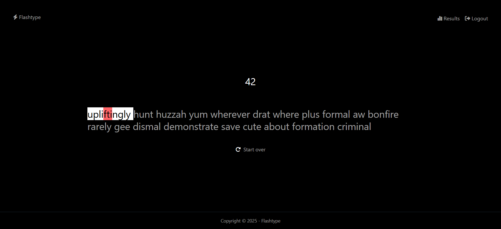

# FlashType — Typing Performance Tracker

FlashType is a modern full-stack typing speed tester and performance tracker built with **React**, **Node.js**, **Express**, **Tailwind CSS**, and **Chart.js**. It visually tracks user accuracy presents meaningful statistics after each test, including WPM, raw WPM, and error rate. All user data is securely stored and can be revisited through a results dashboard.

## Features

- Typing test interface
- Detailed chart-based performance report
- Secure authentication using **http-only cookies**
- Tracks **WPM**, **raw WPM**, **accuracy**, and **error rate**
- Results tab showing all past test records
- Interactive charts for each test via a **Details** button

## 🛠️ Tech Stack

| Frontend | Backend | Authentication   | Styling      | Charts   |
| -------- | ------- | ---------------- | ------------ | -------- |
| React.js | Node.js | HttpOnly Cookies | Tailwind CSS | Chart.js |

## Screenshots

> - Screenshot during start of typing
>   

> - Screenshot during typing
>   

> - Screenshot during login
>   

> - Screenshot of chart generation after typing
>   

> - Screenshot of previous test results
>   

## How It Works

- Users begin a 60-second typing test.
- Each correct character is highlighted in **white**, while incorrect inputs are shown in **light red**.
- After the timer ends, users are shown:
  - **Words per Minute (WPM)**
  - **Raw WPM** (based on all typed characters)
  - **Error percentage**
- All tests are saved and can be viewed later in the **Results** tab.
- Each result has a **Details** view with a visual breakdown using Chart.js.

## Authentication

FlashType uses **http-only cookie-based authentication** for:

- Secure user login
- Session-based access control
- Persistent user data fetching on the backend

## Project Structure (Simplified)

flashtype/
├── client/ # react frontend
│ └── src/
│ └── public/
│ └── package.json
│
├── server/ # express backend API
│ ├── middlewares/ # middlewares
│ ├── routes/ # routes/controllers
│ └── index.js # entry point for Express app
│ └── package.json

## Code

👉 [GitHub Repo](https://github.com/IsteakShupto/flashtype)

> _Replace the above links with your actual URLs_

## Contact

Feel free to reach out or connect on [LinkedIn](https://linkedin.com/in/shupto006) for feedback, collaboration, or just to say hi!
